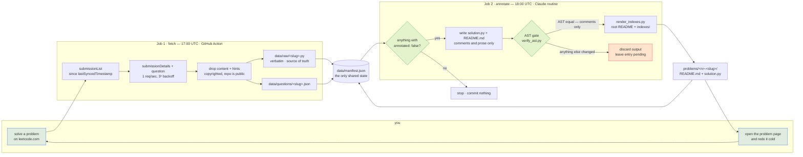

# leetloop

<!-- GENERATED by scripts/render_indexes.py from data/manifest.json. Hand edits are overwritten on the next run. -->

**A LeetCode revision surface that fills itself.** I solve a problem; by the
next afternoon this repo contains a page that gets me back into that problem
months later — the idea that unlocks it, why this approach beats the obvious
one, the traps, and a checklist for rebuilding it from nothing.

[](https://github.com/yadava5/leetloop/actions/workflows/fetch.yml)
[](scripts/verify_ast.py)

  

 

[](LICENSE)

**2 problems** — Easy 2. Solutions in Python.

---

## The loop



Two scheduled jobs, and the split between them is the interesting part.

| | Job | Runs on | Holds | Daily at |
| --- | --- | --- | --- | --- |
| **1** | **fetch** — pull new submissions, commit raw code | GitHub Action, no model involved | the LeetCode cookie | `17:00 UTC` |
| **2** | **annotate** — write the notes, verify, commit | Claude scheduled routine | no credentials at all | `18:00 UTC` |

Each job holds exactly one of the two sensitive things and never needs the
other's. Job 1 keeps the session cookie in GitHub's encrypted secret store and
never talks to a model. Job 2 has no credentials because the scheduled agent
*is* the model — which is why **this system contains no Anthropic API key, and
is designed so that it never needs one.**

## The guarantee: my code is provably unmodified

An LLM writes the commentary, so "it didn't touch my code" has to be *checked*,
not promised. [`scripts/verify_ast.py`](scripts/verify_ast.py) parses the raw
submission and the annotated copy and compares
`ast.dump(tree, annotate_fields=True, include_attributes=False)`.

Python's parser discards comments and blank lines entirely, so they cannot
appear in an AST. **Equal dumps therefore prove every byte of difference is a
comment or whitespace.** A renamed variable, a reordered statement, a changed
literal, an added docstring or a helpfully-fixed bug each change the dump, and
the annotation is discarded instead of committed.

It's checked in both directions — a gate that only ever passes is not a gate.
[`scripts/test_verify_ast.py`](scripts/test_verify_ast.py) asserts 3 cases that
must pass and 5 that must fail, plus the README's inline copy of each solution,
and CI runs it on every fetch.

```
  [ok] gate said PASS, expected PASS   comments and blank lines only
  [ok] gate said PASS, expected PASS   comment on nearly every line
  [ok] gate said FAIL, expected FAIL   one renamed variable (seen -> cache)
  [ok] gate said FAIL, expected FAIL   docstring added
  [ok] gate said FAIL, expected FAIL   two statements reordered
  [ok] gate said FAIL, expected FAIL   return [] changed to return None
  [ok] gate said FAIL, expected FAIL   annotated file does not parse
```

## Problems

| # | Problem | Difficulty | Topics | Solved | Runtime |
| --: | --- | --- | --- | --- | --- |
| 1 | [1. Two Sum](problems/0001-two-sum/README.md) | Easy | Array, Hash Table | 2026-08-05 | 3 ms (top 46%) |
| 20 | [20. Valid Parentheses](problems/0020-valid-parentheses/README.md) | Easy | String, Stack, Bracket Sequences | 2026-08-05 | 4 ms (top 88%) |

Other views: **[by topic](indexes/by-topic.md)** ·
**[by difficulty](indexes/by-difficulty.md)** ·
**[review queue](indexes/review-queue.md)** — spaced repetition with no
bookkeeping, bucketed by how long ago each problem was solved.

## What a problem page contains

Not a code dump. Each [`problems/<n>-<slug>/README.md`](problems) is
self-contained and has nine sections:

1. **Header** — difficulty, topics, date solved, runtime and memory percentiles,
   link to the original.
2. **The problem** — given / return / guaranteed, plus the method signature.
3. **Examples** — invented, with a one-line *why* each, including a
   counterexample to the naive approach.
4. **Constraints, and what each one forces** — every row says what the
   constraint rules in or out, not just the number again.
5. **Key insight** — the one thing I'd want whispered to me if stuck.
6. **Approach** — the walk-through, flagging any step whose *order* is
   load-bearing.
7. **Solution** — the annotated code inline, AST-verified against the raw
   submission like `solution.py` itself.
8. **Why this approach** — the realistic alternatives, each with the specific
   reason this beats it.
9. **Complexity · Pitfalls · Redo from scratch · Related problems.**

## Layout

```
problems/<n>-<slug>/    GENERATED — the revision page + annotated solution
indexes/                GENERATED — by topic, by difficulty, review queue
data/raw/<slug>.py      my submission, verbatim — the gate's reference copy
data/questions/*.json   cached metadata, with LeetCode's prose stripped out
data/manifest.json      the only shared state between the two jobs
src/                    Job 1 — TypeScript ESM, zero runtime dependencies
scripts/verify_ast.py   the gate — plain Python, no dependencies
docs/routine-prompt.txt Job 2 — the entire prompt, version-controlled
```

Anything marked GENERATED is rewritten on every run; hand edits vanish.

## Docs

- **[docs/ARCHITECTURE.md](docs/ARCHITECTURE.md)** — the secret boundary, the
  three fetch stages, exit codes, the manifest schema, and what a non-Python
  language would need instead of AST equality.
- **[docs/RUNBOOK.md](docs/RUNBOOK.md)** — the LeetCode session cookie expires
  every 1–2 weeks and cannot be refreshed programmatically, so the pipeline
  files a GitHub issue and emails me. Fixing it is two commands.
- **[docs/ROUTINE.md](docs/ROUTINE.md)** — how Job 2 is scheduled and how to
  change its prompt safely.

## On copyright

LeetCode's problem statements are theirs, and this repo is public. Job 1 never
persists the statement or the hints; Job 2 reads the statement at annotate time
and writes only its own restatement, with my own examples. A pre-commit hook
blocks that prose from reappearing, because history here is append-only and a
leak committed once could not be taken back.

MIT licensed — the notes and the pipeline, not the problems.
