<!-- GENERATED by scripts/render_indexes.py from data/manifest.json. Hand edits are overwritten on the next run. -->

<p align="center">
  <picture>
    <source media="(prefers-color-scheme: dark)" srcset="assets/logo-dark.svg">
    <source media="(prefers-color-scheme: light)" srcset="assets/logo-light.svg">
    
  </picture>
</p>

<h1 align="center">leetloop</h1>

<p align="center">
  <strong>A LeetCode revision surface that fills itself.</strong><br>
  I solve a problem; by the next afternoon this repo holds a page that gets me
  back into it months later — the idea that unlocks it, why this approach beats
  the obvious one, the traps, and a checklist for rebuilding it from nothing.
</p>

<p align="center">
  <a href="https://github.com/yadava5/leetloop/actions/workflows/fetch.yml"></a> <a href="scripts/verify_ast.py"></a>         <a href="LICENSE"></a>
</p>

> **3 problems fetched but not annotated yet.** Job 1 commits the code at
> 17:00 UTC and Job 2 writes the page an hour later, so a gap here is normal in between runs. If it persists, the watchdog opens an issue — see [docs/RUNBOOK.md](docs/RUNBOOK.md).

**30 problems** — Easy 16 · Medium 14. Solutions in Python.

---

## The loop

<p align="center">
  <picture>
    <source media="(prefers-color-scheme: dark)" srcset="assets/pipeline-dark.svg">
    <source media="(prefers-color-scheme: light)" srcset="assets/pipeline-light.svg">
    
  </picture>
</p>

<details>
<summary>Same thing as a Mermaid flowchart, if you'd rather read the graph</summary>



</details>

```mermaid
flowchart LR
    subgraph you["you"]
        SOLVE["solve a problem<br/>on leetcode.com"]
        REVISE["open the problem page<br/>and redo it cold"]
    end

    subgraph job1["Job 1 · fetch — 17:00 UTC · GitHub Action"]
        FETCH["submissionList<br/>since lastSyncedTimestamp"]
        HYDRATE["submissionDetails + question<br/>1 req/sec, 3ⁿ backoff"]
        STRIP["drop content + hints<br/>copyrighted, repo is public"]
        RAW["data/raw/&lt;slug&gt;.py<br/>verbatim · source of truth"]
        META["data/questions/&lt;slug&gt;.json"]
    end

    subgraph job2["Job 2 · annotate — 2 pm ET · Claude routine"]
        PENDING{"anything with<br/>annotated: false?"}
        WRITE["write solution.py + README.md<br/>comments and prose only"]
        GATE{"AST gate<br/>verify_ast.py"}
        RENDER["render_indexes.py<br/>root README + indexes/"]
        DISCARD["discard output<br/>leave entry pending"]
        BRANCH["push a feature branch<br/>(cannot push to main)"]
    end

    subgraph job3["Job 3 · promote — on that push · GitHub Action"]
        REGATE{"re-run the gate<br/>where the annotator<br/>has no influence"}
        REJECT["refuse · file an issue<br/>branch left for inspection"]
    end

    PAGES["main<br/>problems/&lt;n&gt;-&lt;slug&gt;/"]
    MANIFEST[("data/manifest.json<br/>the only shared state")]
    WATCH{{"Job 4 · watchdog — 4 pm ET<br/>anything pending 30 h+? file an issue"}}

    SOLVE --> FETCH --> HYDRATE --> STRIP --> RAW & META
    RAW & META --> MANIFEST
    MANIFEST --> PENDING
    PENDING -- "no" --> STOP["stop · commit nothing"]
    PENDING -- "yes" --> WRITE --> GATE
    GATE -- "AST equal — comments only" --> RENDER --> BRANCH
    GATE -- "anything else changed" --> DISCARD
    BRANCH --> REGATE
    REGATE -- "passes again" --> PAGES
    REGATE -- "fails" --> REJECT
    PAGES --> MANIFEST
    PAGES --> REVISE --> SOLVE
    MANIFEST -.-> WATCH

    classDef human fill:#1f6feb22,stroke:#1f6feb,stroke-width:1px
    classDef gate fill:#2ea44f22,stroke:#2ea44f,stroke-width:1px
    classDef bad fill:#ff375f22,stroke:#ff375f,stroke-width:1px
    class SOLVE,REVISE human
    class GATE,PENDING gate
    class DISCARD bad
```

Two scheduled jobs do the work, and two more keep them honest. The split
between the first two is the interesting part.

| | Job | Runs on | Holds | When |
| --- | --- | --- | --- | --- |
| **1** | **fetch** — pull new submissions, commit raw code | GitHub Action, no model involved | the LeetCode cookie | 1 pm ET daily |
| **2** | **annotate** — write the notes, verify, push a branch | Claude scheduled routine | no credentials at all | 2 pm ET daily |
| **3** | **promote** — re-verify, then fast-forward `main` | GitHub Action | nothing | when Job 2 pushes |
| **4** | **watchdog** — open an issue if anything is stuck | GitHub Action | nothing | 4 pm ET daily |

Jobs 3 and 4 exist because of two things the first version got wrong. A Claude
routine **cannot push to `main`** — its environment pins it to a feature branch —
so `promote` does the last mile, and re-runs the AST gate while it's there. And a
green routine run turned out not to mean the work had landed, which is a failure
you cannot see; the watchdog looks every day and files an issue if anything sat
un-annotated for more than 30 hours.

Each job holds exactly one of the two sensitive things and never needs the
other's. Job 1 keeps the session cookie in GitHub's encrypted secret store and
never talks to a model. Job 2 has no credentials because the scheduled agent
*is* the model — which is why **this system contains no Anthropic API key, and
is designed so that it never needs one.**

## The guarantee: my code is provably unmodified

An LLM writes the commentary, so "it didn't touch my code" has to be *checked*,
not promised. [`scripts/verify_ast.py`](scripts/verify_ast.py) parses the raw
submission and the annotated copy and compares
`ast.dump(tree, annotate_fields=True, include_attributes=False)`.

Python's parser discards comments and blank lines entirely, so they cannot
appear in an AST. **Equal dumps therefore prove every byte of difference is a
comment or whitespace.** A renamed variable, a reordered statement, a changed
literal, an added docstring or a helpfully-fixed bug each change the dump, and
the annotation is discarded instead of committed.

It's checked in both directions — a gate that only ever passes is not a gate.
[`scripts/test_verify_ast.py`](scripts/test_verify_ast.py) asserts 3 cases that
must pass and 5 that must fail, plus 4 more for the copy of the solution shown
inline on a problem page, and CI runs it on every fetch. The real pages are gated
too: `verify_ast.py --all` checks every `python` fence that claims to be the
submission.

And it runs **twice**: once inside the routine, and again in `promote`, on GitHub's
infrastructure where the thing being checked has no influence over the checker.
An annotation that quietly edited my code would have to defeat the same gate in
two places, one of which it cannot reach.

`npm run test:gate` — the eight cases, and the verdict each one has to get:

```
  [ok] gate said PASS, expected PASS   comments and blank lines only
  [ok] gate said PASS, expected PASS   comment on nearly every line
  [ok] gate said PASS, expected PASS   identical file
  [ok] gate said FAIL, expected FAIL   one renamed variable (seen -> cache)
  [ok] gate said FAIL, expected FAIL   docstring added
  [ok] gate said FAIL, expected FAIL   two statements reordered
  [ok] gate said FAIL, expected FAIL   return [] changed to return None
  [ok] gate said FAIL, expected FAIL   annotated file does not parse
```

## Problems

| # | Problem | Difficulty | Topics | Solved | Runtime |
| --: | --- | --- | --- | --- | --- |
| 1 | [1. Two Sum](problems/0001-two-sum/README.md) | Easy | Array, Hash Table | 2026-08-05 | 3 ms (top 46%) |
| 3 | [3. Longest Substring Without Repeating Characters](problems/0003-longest-substring-without-repeating-characters/README.md) | Medium | Hash Table, String, Sliding Window | 2026-09-15 | 172 ms (top 23%) |
| 5 | [5. Longest Palindromic Substring](problems/0005-longest-palindromic-substring/README.md) | Medium | Two Pointers, String, Dynamic Programming, Manacher | 2026-09-18 | 297 ms (top 54%) |
| 9 | [9. Palindrome Number](problems/0009-palindrome-number/README.md) | Easy | Math | 2026-09-16 | 13 ms (top 76%) |
| 14 | [14. Longest Common Prefix](problems/0014-longest-common-prefix/README.md) | Easy | Array, String, Trie | 2026-08-17 | 0 ms (top 0%) |
| 20 | [20. Valid Parentheses](problems/0020-valid-parentheses/README.md) | Easy | String, Stack, Bracket Sequences | 2026-08-05 | 4 ms (top 88%) |
| 26 | [26. Remove Duplicates from Sorted Array](problems/0026-remove-duplicates-from-sorted-array/README.md) | Easy | Array, Two Pointers | 2026-09-14 | 0 ms (top 0%) |
| 27 | [27. Remove Element](problems/0027-remove-element/README.md) | Easy | Array, Two Pointers | 2026-08-17 | 0 ms (top 0%) |
| 49 | [49. Group Anagrams](problems/0049-group-anagrams/README.md) | Medium | Array, Hash Table, String, Sorting | 2026-08-17 | 7 ms (top 2%) |
| 53 | 53. Maximum Subarray — _awaiting annotation_ | Medium | Array, Divide and Conquer, Dynamic Programming | 2026-09-17 | 19 ms (top 3%) |
| 75 | [75. Sort Colors](problems/0075-sort-colors/README.md) | Medium | Array, Two Pointers, Sorting, Quicksort, Bubble Sort | 2026-08-18 | 0 ms (top 0%) |
| 121 | [121. Best Time to Buy and Sell Stock](problems/0121-best-time-to-buy-and-sell-stock/README.md) | Easy | Array, Dynamic Programming | 2026-09-17 | 18 ms (top 4%) |
| 122 | [122. Best Time to Buy and Sell Stock II](problems/0122-best-time-to-buy-and-sell-stock-ii/README.md) | Medium | Array, Dynamic Programming, Greedy | 2026-09-17 | 0 ms (top 0%) |
| 125 | [125. Valid Palindrome](problems/0125-valid-palindrome/README.md) | Easy | Two Pointers, String | 2026-09-15 | 7 ms (top 19%) |
| 128 | [128. Longest Consecutive Sequence](problems/0128-longest-consecutive-sequence/README.md) | Medium | Array, Hash Table, Union-Find | 2026-09-15 | 48 ms (top 37%) |
| 167 | [167. Two Sum II - Input Array Is Sorted](problems/0167-two-sum-ii-input-array-is-sorted/README.md) | Medium | Array, Two Pointers, Binary Search | 2026-09-16 | 11 ms (top 95%) |
| 169 | [169. Majority Element](problems/0169-majority-element/README.md) | Easy | Array, Hash Table, Divide and Conquer, Sorting, Counting, Boyer–Moore Majority Vote Algorithm | 2026-09-14 | 7 ms (top 42%) |
| 219 | [219. Contains Duplicate II](problems/0219-contains-duplicate-ii/README.md) | Easy | Array, Hash Table, Sliding Window | 2026-09-16 | 41 ms (top 20%) |
| 242 | [242. Valid Anagram](problems/0242-valid-anagram/README.md) | Easy | Hash Table, String, Sorting | 2026-08-16 | 3 ms (top 2%) |
| 283 | [283. Move Zeroes](problems/0283-move-zeroes/README.md) | Easy | Array, Two Pointers | 2026-09-14 | 3 ms (top 18%) |
| 303 | [303. Range Sum Query - Immutable](problems/0303-range-sum-query-immutable/README.md) | Easy | Array, Design, Prefix Sum | 2026-08-19 | 0 ms (top 0%) |
| 347 | [347. Top K Frequent Elements](problems/0347-top-k-frequent-elements/README.md) | Medium | Array, Hash Table, Divide and Conquer, Sorting, Heap (Priority Queue), Bucket Sort, Counting, Quickselect | 2026-08-18 | 0 ms (top 0%) |
| 560 | 560. Subarray Sum Equals K — _awaiting annotation_ | Medium | Array, Hash Table, Prefix Sum | 2026-09-18 | 35 ms (top 54%) |
| 647 | [647. Palindromic Substrings](problems/0647-palindromic-substrings/README.md) | Medium | Two Pointers, String, Dynamic Programming | 2026-09-15 | 117 ms (top 26%) |
| 705 | [705. Design HashSet](problems/0705-design-hashset/README.md) | Easy | Array, Hash Table, Linked List, Design, Hash Function | 2026-08-17 | 47 ms (top 53%) |
| 706 | [706. Design HashMap](problems/0706-design-hashmap/README.md) | Easy | Array, Hash Table, Linked List, Design, Hash Function | 2026-08-17 | 21 ms (top 7%) |
| 739 | [739. Daily Temperatures](problems/0739-daily-temperatures/README.md) | Medium | Array, Stack, Monotonic Stack | 2026-09-17 | 94 ms (top 43%) |
| 904 | 904. Fruit Into Baskets — _awaiting annotation_ | Medium | Array, Hash Table, Sliding Window | 2026-09-18 | 192 ms (top 61%) |
| 912 | [912. Sort an Array](problems/0912-sort-an-array/README.md) | Medium | Array, Divide and Conquer, Sorting, Heap (Priority Queue), Merge Sort, Bucket Sort, Radix Sort, Counting Sort | 2026-08-17 | 643 ms (top 52%) |
| 1929 | [1929. Concatenation of Array](problems/1929-concatenation-of-array/README.md) | Easy | Array, Simulation | 2026-08-18 | 3 ms (top 82%) |

Other views: **[by topic](indexes/by-topic.md)** ·
**[by difficulty](indexes/by-difficulty.md)** ·
**[review queue](indexes/review-queue.md)** — spaced repetition with no
bookkeeping, bucketed by how long ago each problem was solved.

## What a problem page contains

Not a code dump. Each [`problems/<n>-<slug>/README.md`](problems) is
self-contained and has nine sections:

1. **Header** — difficulty, topics, date solved, runtime and memory percentiles,
   link to the original.
2. **The problem** — given / return / guaranteed, plus the method signature.
3. **Examples** — invented, with a one-line *why* each, including a
   counterexample to the naive approach.
4. **Constraints, and what each one forces** — every row says what the
   constraint rules in or out, not just the number again.
5. **Key insight** — the one thing I'd want whispered to me if stuck.
6. **Approach** — the walk-through, flagging any step whose *order* is
   load-bearing.
7. **Solution** — the annotated code inline, AST-verified against the raw
   submission like `solution.py` itself.
8. **Why this approach** — the realistic alternatives, each with the specific
   reason this beats it.
9. **Complexity · Pitfalls · Redo from scratch · Related problems.**

## Layout

```
problems/<n>-<slug>/    GENERATED — the revision page + annotated solution
indexes/                GENERATED — by topic, by difficulty, review queue
data/raw/<slug>.py      my submission, verbatim — the gate's reference copy
data/questions/*.json   cached metadata, with LeetCode's prose stripped out
data/manifest.json      the only shared state between the two jobs
src/                    Job 1 — TypeScript ESM, zero runtime dependencies
scripts/verify_ast.py   the gate — plain Python, no dependencies
docs/routine-prompt.txt Job 2 — the entire prompt, version-controlled
```

Anything marked GENERATED is rewritten on every run; hand edits vanish.

## Fork it and point it at your own account

It is built to be forked — nothing about the pipeline is specific to me except
the contents of `data/`. **[docs/FORKING.md](docs/FORKING.md) is the full
walkthrough**; the shape of it is:

1. **Fork**, then wipe my data — `data/`, `problems/`, `indexes/` — and reset the
   manifest to empty. One block of commands in the guide.
2. **Add two secrets** from your own browser: `LEETCODE_SESSION` and
   `LEETCODE_CSRF_TOKEN`. This is the only credential in the system.
3. **Enable Actions.** GitHub disables scheduled workflows in forks until you turn
   them on, so this step is easy to miss and looks like a silent failure.
4. **Create the annotation routine** at <https://claude.ai/code/routines>, pasting
   [`docs/routine-prompt.txt`](docs/routine-prompt.txt). Needs a Claude plan that
   includes scheduled routines — this is the one part you can't substitute without
   reintroducing an API key.
5. **Solve something** and wait for the next 17:00 UTC.

You do not need to edit any code: the CI badge and links derive the repo slug from
your git remote, and the committer name and email come from repository variables
with sensible defaults. **If you solve in a language other than Python, read the
gate section of the guide first** — AST equality is exact only because Python
discards comments at parse time, and the gate deliberately refuses to guess for
other languages.

## Docs

- **[docs/ARCHITECTURE.md](docs/ARCHITECTURE.md)** — the secret boundary, the
  three fetch stages, exit codes, the manifest schema, and what a non-Python
  language would need instead of AST equality.
- **[docs/RUNBOOK.md](docs/RUNBOOK.md)** — the LeetCode session cookie expires
  every 1–2 weeks and cannot be refreshed programmatically, so the pipeline
  files a GitHub issue and emails me. Fixing it is two commands.
- **[docs/ROUTINE.md](docs/ROUTINE.md)** — how Job 2 is scheduled and how to
  change its prompt safely.
- **[docs/FORKING.md](docs/FORKING.md)** — running your own copy end to end.

## Verify it

None of this has to be taken on trust. Clone the repo and run the three commands
CI runs — plain Python 3, no dependencies, no credentials, no Anthropic key:

```bash
git clone https://github.com/yadava5/leetloop && cd leetloop

python3 scripts/test_verify_ast.py   # does the gate still reject modified code?
python3 scripts/verify_ast.py --all  # is every annotation here comments-only?
python3 scripts/render_indexes.py    # does this page regenerate unchanged?
```

The third is the one people skip. This README is generated from
`data/manifest.json`, so any claim on it the data does not support shows up as a
diff — the problem counts and the badges at the top of the page included. The
script prints `unchanged` or `written` per file, and everything should say
`unchanged` except [`indexes/review-queue.md`](indexes/review-queue.md): that one
buckets problems by how long ago they were solved, so it is a function of today's
date and rewrites itself when the day rolls over. Running this on a later day
than the last render will therefore show that one file as `written`, and only
that one. CI never meets the case, because `promote` renders immediately before
it pushes — so the check below lands on the same UTC day and `main` stays
byte-identical to its generator.

[`.github/workflows/verify.yml`](.github/workflows/verify.yml) runs all three on
**every push to `main`**, plus two more, and files an issue when any of them
fails — then closes it once `main` verifies again.

| Asserted against `main` on every push | Goes red when |
| --- | --- |
| the gate self-test | the gate stops rejecting modified code |
| `verify_ast.py --all` | an annotation differs from `data/raw/` by more than comments |
| generated files match the generator | this README or `indexes/` was hand-edited |
| no `content` or `hints` keys in `data/questions/` | LeetCode's own prose reached the repo |
| no README link to a page that isn't there | the front page points at a missing problem |

`promote` gates the route an annotation arrives by; `verify` gates the
destination, so a commit that reached `main` some other way is still checked.
That separation is the whole reason it is a second workflow, and the reasoning is
written at the top of the file.

## What this does and does not guarantee

The gate proves one thing: that `solution.py`, and the copy shown inline on each
problem page, differ from the submitted code by comments and whitespace alone. It
is a narrow claim on purpose. Everything below is outside it.

**It does not say the notes are right.** Every word of prose on a problem page —
the key insight, the complexity argument, the pitfalls, the invented examples — is
written by an automated Claude routine and is checked by nothing. No human reads a
page before it lands: once the gate passes, `promote` fast-forwards `main` on its
own. Confidently wrong commentary sitting beside provably unmodified code is the
failure this repo cannot detect. Read the notes the way you'd read a stranger's.

**The reference copy is only as good as Job 1.** The gate compares against
`data/raw/<slug>.py`, which is what LeetCode's API returned for that submission
id. It establishes that the annotator changed nothing. It says nothing about
whether the fetch itself was faithful.

**Python only.** AST equality is exact here because Python's parser throws
comments away. For any other language `verify_ast.py` refuses to guess rather than
offer a weaker check under the same name;
[docs/ARCHITECTURE.md](docs/ARCHITECTURE.md) covers what an equivalent would need.

**The percentiles are LeetCode's, recorded once.** Runtime and memory rankings are
copied from the submission at fetch time and never re-measured, so they drift as
other people submit.

**The copyright checks are heuristics, not proofs.** The pre-commit hook and
`verify` both reject the `content` and `hints` keys and flag a suspiciously long
`constraints` entry, which catches the mechanical leak — metadata written straight
through. Neither can tell that a paragraph of prose was copy-pasted. That part
rests on the routine restating the problem in its own words, and on someone
reading it.

**The prompt in this repo may not be the prompt that ran.**
[`docs/routine-prompt.txt`](docs/routine-prompt.txt) is version-controlled, but
the copy that executes lives in the routines UI and nothing syncs the two — there
is no API to read the live one back, and they have diverged once already.
[`scripts/check_prompt_sync.py`](scripts/check_prompt_sync.py) prints a fingerprint
to eyeball against the UI, which is as close to a check as this gets.

**The second gate run rests on a platform behaviour, not a promise.** A Claude
routine cannot push to `main` today, which is what forces every annotation through
`promote` and its independent re-run. If that ever changes, `promote` quietly
stops being in the path. `verify` exists so the invariants are asserted against
`main` however a commit got there.

## Credits

The logo and the pipeline diagram in this README are original SVGs — animated with
CSS inside the file, one variant per colour scheme, no JavaScript, since GitHub
sanitises scripts out of rendered markdown. They live in
[`assets/`](assets) and are MIT-licensed along with everything else here, so reuse
them if they're useful.

## On copyright

LeetCode's problem statements are theirs, and this repo is public. Job 1 never
persists the statement or the hints; Job 2 reads the statement at annotate time
and writes only its own restatement, with my own examples. A pre-commit hook
blocks that prose from reappearing, because history here is append-only and a
leak committed once could not be taken back.

MIT licensed — the notes and the pipeline, not the problems.

## Author

**Ayush Yadav** — sole author and maintainer.
[github.com/yadava5](https://github.com/yadava5)

## License

MIT — see [`LICENSE`](LICENSE). Copyright © 2026 Ayush Yadav. That covers the
pipeline, the gate, the revision notes and the SVGs in `assets/`; it does not
cover LeetCode's problems, which are theirs. See
[On copyright](#on-copyright) above.
