<!-- GENERATED by scripts/render_indexes.py from data/manifest.json. Hand edits are overwritten on the next run. -->

<p align="center">
  <picture>
    <source media="(prefers-color-scheme: dark)" srcset="assets/logo-dark.svg">
    <source media="(prefers-color-scheme: light)" srcset="assets/logo-light.svg">
    
  </picture>
</p>

<p align="center">
  <strong>A LeetCode revision surface that fills itself.</strong><br>
  I solve a problem; by the next afternoon this repo holds a page that gets me
  back into it months later — the idea that unlocks it, why this approach beats
  the obvious one, the traps, and a checklist for rebuilding it from nothing.
</p>

<p align="center">
  <a href="https://github.com/yadava5/leetloop/actions/workflows/fetch.yml"></a> <a href="scripts/verify_ast.py"></a>         <a href="LICENSE"></a>
</p>

**2 problems** — Easy 2. Solutions in Python.

---

## The loop

<p align="center">
  <picture>
    <source media="(prefers-color-scheme: dark)" srcset="assets/pipeline-dark.svg">
    <source media="(prefers-color-scheme: light)" srcset="assets/pipeline-light.svg">
    
  </picture>
</p>

<details>
<summary>Same thing as a Mermaid flowchart, if you'd rather read the graph</summary>



</details>

```mermaid
flowchart LR
    subgraph you["you"]
        SOLVE["solve a problem<br/>on leetcode.com"]
        REVISE["open the problem page<br/>and redo it cold"]
    end

    subgraph job1["Job 1 · fetch — 17:00 UTC · GitHub Action"]
        FETCH["submissionList<br/>since lastSyncedTimestamp"]
        HYDRATE["submissionDetails + question<br/>1 req/sec, 3ⁿ backoff"]
        STRIP["drop content + hints<br/>copyrighted, repo is public"]
        RAW["data/raw/&lt;slug&gt;.py<br/>verbatim · source of truth"]
        META["data/questions/&lt;slug&gt;.json"]
    end

    subgraph job2["Job 2 · annotate — 2 pm ET · Claude routine"]
        PENDING{"anything with<br/>annotated: false?"}
        WRITE["write solution.py + README.md<br/>comments and prose only"]
        GATE{"AST gate<br/>verify_ast.py"}
        RENDER["render_indexes.py<br/>root README + indexes/"]
        DISCARD["discard output<br/>leave entry pending"]
        BRANCH["push a feature branch<br/>(cannot push to main)"]
    end

    subgraph job3["Job 3 · promote — on that push · GitHub Action"]
        REGATE{"re-run the gate<br/>where the annotator<br/>has no influence"}
        REJECT["refuse · file an issue<br/>branch left for inspection"]
    end

    PAGES["main<br/>problems/&lt;n&gt;-&lt;slug&gt;/"]
    MANIFEST[("data/manifest.json<br/>the only shared state")]
    WATCH{{"Job 4 · watchdog — 4 pm ET<br/>anything pending 30 h+? file an issue"}}

    SOLVE --> FETCH --> HYDRATE --> STRIP --> RAW & META
    RAW & META --> MANIFEST
    MANIFEST --> PENDING
    PENDING -- "no" --> STOP["stop · commit nothing"]
    PENDING -- "yes" --> WRITE --> GATE
    GATE -- "AST equal — comments only" --> RENDER --> BRANCH
    GATE -- "anything else changed" --> DISCARD
    BRANCH --> REGATE
    REGATE -- "passes again" --> PAGES
    REGATE -- "fails" --> REJECT
    PAGES --> MANIFEST
    PAGES --> REVISE --> SOLVE
    MANIFEST -.-> WATCH

    classDef human fill:#1f6feb22,stroke:#1f6feb,stroke-width:1px
    classDef gate fill:#2ea44f22,stroke:#2ea44f,stroke-width:1px
    classDef bad fill:#ff375f22,stroke:#ff375f,stroke-width:1px
    class SOLVE,REVISE human
    class GATE,PENDING gate
    class DISCARD bad
```

Two scheduled jobs do the work, and two more keep them honest. The split
between the first two is the interesting part.

| | Job | Runs on | Holds | When |
| --- | --- | --- | --- | --- |
| **1** | **fetch** — pull new submissions, commit raw code | GitHub Action, no model involved | the LeetCode cookie | 1 pm ET daily |
| **2** | **annotate** — write the notes, verify, push a branch | Claude scheduled routine | no credentials at all | 2 pm ET daily |
| **3** | **promote** — re-verify, then fast-forward `main` | GitHub Action | nothing | when Job 2 pushes |
| **4** | **watchdog** — open an issue if anything is stuck | GitHub Action | nothing | 4 pm ET daily |

Jobs 3 and 4 exist because of two things the first version got wrong. A Claude
routine **cannot push to `main`** — its environment pins it to a feature branch —
so `promote` does the last mile, and re-runs the AST gate while it's there. And a
green routine run turned out not to mean the work had landed, which is a failure
you cannot see; the watchdog looks every day and files an issue if anything sat
un-annotated for more than 30 hours.

Each job holds exactly one of the two sensitive things and never needs the
other's. Job 1 keeps the session cookie in GitHub's encrypted secret store and
never talks to a model. Job 2 has no credentials because the scheduled agent
*is* the model — which is why **this system contains no Anthropic API key, and
is designed so that it never needs one.**

## The guarantee: my code is provably unmodified

An LLM writes the commentary, so "it didn't touch my code" has to be *checked*,
not promised. [`scripts/verify_ast.py`](scripts/verify_ast.py) parses the raw
submission and the annotated copy and compares
`ast.dump(tree, annotate_fields=True, include_attributes=False)`.

Python's parser discards comments and blank lines entirely, so they cannot
appear in an AST. **Equal dumps therefore prove every byte of difference is a
comment or whitespace.** A renamed variable, a reordered statement, a changed
literal, an added docstring or a helpfully-fixed bug each change the dump, and
the annotation is discarded instead of committed.

It's checked in both directions — a gate that only ever passes is not a gate.
[`scripts/test_verify_ast.py`](scripts/test_verify_ast.py) asserts 3 cases that
must pass and 5 that must fail, plus the README's inline copy of each solution,
and CI runs it on every fetch.

And it runs **twice**: once inside the routine, and again in `promote`, on GitHub's
infrastructure where the thing being checked has no influence over the checker.
An annotation that quietly edited my code would have to defeat the same gate in
two places, one of which it cannot reach.

```
  [ok] gate said PASS, expected PASS   comments and blank lines only
  [ok] gate said PASS, expected PASS   comment on nearly every line
  [ok] gate said FAIL, expected FAIL   one renamed variable (seen -> cache)
  [ok] gate said FAIL, expected FAIL   docstring added
  [ok] gate said FAIL, expected FAIL   two statements reordered
  [ok] gate said FAIL, expected FAIL   return [] changed to return None
  [ok] gate said FAIL, expected FAIL   annotated file does not parse
```

## Problems

| # | Problem | Difficulty | Topics | Solved | Runtime |
| --: | --- | --- | --- | --- | --- |
| 1 | [1. Two Sum](problems/0001-two-sum/README.md) | Easy | Array, Hash Table | 2026-08-05 | 3 ms (top 46%) |
| 20 | [20. Valid Parentheses](problems/0020-valid-parentheses/README.md) | Easy | String, Stack, Bracket Sequences | 2026-08-05 | 4 ms (top 88%) |

Other views: **[by topic](indexes/by-topic.md)** ·
**[by difficulty](indexes/by-difficulty.md)** ·
**[review queue](indexes/review-queue.md)** — spaced repetition with no
bookkeeping, bucketed by how long ago each problem was solved.

## What a problem page contains

Not a code dump. Each [`problems/<n>-<slug>/README.md`](problems) is
self-contained and has nine sections:

1. **Header** — difficulty, topics, date solved, runtime and memory percentiles,
   link to the original.
2. **The problem** — given / return / guaranteed, plus the method signature.
3. **Examples** — invented, with a one-line *why* each, including a
   counterexample to the naive approach.
4. **Constraints, and what each one forces** — every row says what the
   constraint rules in or out, not just the number again.
5. **Key insight** — the one thing I'd want whispered to me if stuck.
6. **Approach** — the walk-through, flagging any step whose *order* is
   load-bearing.
7. **Solution** — the annotated code inline, AST-verified against the raw
   submission like `solution.py` itself.
8. **Why this approach** — the realistic alternatives, each with the specific
   reason this beats it.
9. **Complexity · Pitfalls · Redo from scratch · Related problems.**

## Layout

```
problems/<n>-<slug>/    GENERATED — the revision page + annotated solution
indexes/                GENERATED — by topic, by difficulty, review queue
data/raw/<slug>.py      my submission, verbatim — the gate's reference copy
data/questions/*.json   cached metadata, with LeetCode's prose stripped out
data/manifest.json      the only shared state between the two jobs
src/                    Job 1 — TypeScript ESM, zero runtime dependencies
scripts/verify_ast.py   the gate — plain Python, no dependencies
docs/routine-prompt.txt Job 2 — the entire prompt, version-controlled
```

Anything marked GENERATED is rewritten on every run; hand edits vanish.

## Fork it and point it at your own account

It is built to be forked — nothing about the pipeline is specific to me except
the contents of `data/`. **[docs/FORKING.md](docs/FORKING.md) is the full
walkthrough**; the shape of it is:

1. **Fork**, then wipe my data — `data/`, `problems/`, `indexes/` — and reset the
   manifest to empty. One block of commands in the guide.
2. **Add two secrets** from your own browser: `LEETCODE_SESSION` and
   `LEETCODE_CSRF_TOKEN`. This is the only credential in the system.
3. **Enable Actions.** GitHub disables scheduled workflows in forks until you turn
   them on, so this step is easy to miss and looks like a silent failure.
4. **Create the annotation routine** at <https://claude.ai/code/routines>, pasting
   [`docs/routine-prompt.txt`](docs/routine-prompt.txt). Needs a Claude plan that
   includes scheduled routines — this is the one part you can't substitute without
   reintroducing an API key.
5. **Solve something** and wait for the next 17:00 UTC.

You do not need to edit any code: the CI badge and links derive the repo slug from
your git remote, and the committer name and email come from repository variables
with sensible defaults. **If you solve in a language other than Python, read the
gate section of the guide first** — AST equality is exact only because Python
discards comments at parse time, and the gate deliberately refuses to guess for
other languages.

## Docs

- **[docs/ARCHITECTURE.md](docs/ARCHITECTURE.md)** — the secret boundary, the
  three fetch stages, exit codes, the manifest schema, and what a non-Python
  language would need instead of AST equality.
- **[docs/RUNBOOK.md](docs/RUNBOOK.md)** — the LeetCode session cookie expires
  every 1–2 weeks and cannot be refreshed programmatically, so the pipeline
  files a GitHub issue and emails me. Fixing it is two commands.
- **[docs/ROUTINE.md](docs/ROUTINE.md)** — how Job 2 is scheduled and how to
  change its prompt safely.
- **[docs/FORKING.md](docs/FORKING.md)** — running your own copy end to end.

## Credits

The logo and the pipeline diagram in this README are original SVGs — animated with
CSS inside the file, one variant per colour scheme, no JavaScript, since GitHub
sanitises scripts out of rendered markdown. They live in
[`assets/`](assets) and are MIT-licensed along with everything else here, so reuse
them if they're useful.

## On copyright

LeetCode's problem statements are theirs, and this repo is public. Job 1 never
persists the statement or the hints; Job 2 reads the statement at annotate time
and writes only its own restatement, with my own examples. A pre-commit hook
blocks that prose from reappearing, because history here is append-only and a
leak committed once could not be taken back.

MIT licensed — the notes and the pipeline, not the problems.
